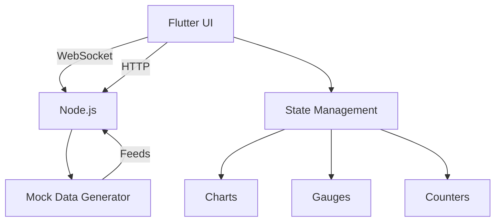

```markdown
# 🌐 HitDash - Real-Time Analytics Dashboard

  
*A beautiful Flutter dashboard for monitoring website metrics in real-time*

## 📌 Table of Contents
- [Features](#-features)
- [Tech Stack](#-tech-stack)
- [Installation](#-installation)
- [Running the Project](#-running-the-project)
- [Project Structure](#-project-structure)
=- [Troubleshooting](#-troubleshooting)

## 🚀 Features

### 📊 Real-Time Metrics
- **👥 Active Users**: Current visitor counter
- **📈 Page Views**: Interactive line chart
- **⏱️ Avg Session Duration**: Radial gauge display

### 🔌 Connection Modes
- **WebSocket (Default)**: Low-latency push updates
- **HTTP Polling**: Fallback with configurable interval
- **Smart Toggle**: Animated switch between modes

### 🎨 UI Highlights
- Custom animated widgets
- Responsive layout (mobile/desktop)
- Theme system with dark/light support
- Smooth data transitions

## 🛠 Tech Stack

### Frontend
| Component       | Technology               | Location               |
|-----------------|--------------------------|------------------------|
| Framework       | Flutter 3.x             | `lib/`                |
| State Management| Provider                | `lib/presentation/provider/` |
| Charts          | fl_chart                | `lib/presentation/dashboard/` |
| WebSocket       | web_socket_channel      | `lib/common/helpers/` |

### Backend
| Component       | Technology               |
|-----------------|--------------------------|
| Runtime         | Node.js 16+             |
| Framework       | Express                 |
| WebSocket       | ws                      |

## 📥 Installation

### Prerequisites
- Flutter 3.0+ (`flutter --version`)
- Node.js 16+ (`node -v`)
- npm/yarn (`npm -v`)

### Setup
```bash
# Clone repository
git clone https://github.com/yourusername/HitDash.git
cd HitDash

# Backend setup
cd backend
npm install

# Frontend setup
cd ..
flutter pub get
```

## ▶️ Running the Project

### Development
1. Start backend server:
```bash
cd backend
node server.js
```

2. Run Flutter app (in new terminal):
```bash
cd ..
flutter run
```

### Production Builds
```bash
# Android
flutter build apk --release

# iOS
flutter build ios --release

# Web
flutter build web
```

## 🗂 Project Structure

```
HitDash/
├── backend/                # Node.js server
│   ├── server.js           # WebSocket/HTTP server
│   └── package.json        # Dependencies
│
├── lib/                    # Flutter source
│   ├── common/             
│   │   ├── constants/      # App constants
│   │   ├── helpers/        # Utilities
│   │   └── style/          # App styling
│   │
│   ├── presentation/
│   │   ├── dashboard/      # Dashboard UI
│   │   │   └── dashboard_screen.dart
│   │   └── provider/       # State management
│   │       └── data_provider.dart
│   │
│   └── main.dart           # App entry point
│
├── assets/                 # Media files
│   ├── eye.gif             # Sample asset
│   └── user.gif            # Sample asset
│
└── pubspec.yaml            # Flutter dependencies
```


## 🏗 Architecture



## 🐛 Troubleshooting

| Issue                      | Solution                                  |
|----------------------------|-------------------------------------------|
| WebSocket connection fails | 1. Check backend is running<br>2. Verify ports aren't blocked |
| No data updates            | Toggle connection mode in app bar         |
| UI rendering issues        | Run `flutter clean` and rebuild           |
| Missing dependencies       | Run `flutter pub get` or `npm install`    |

